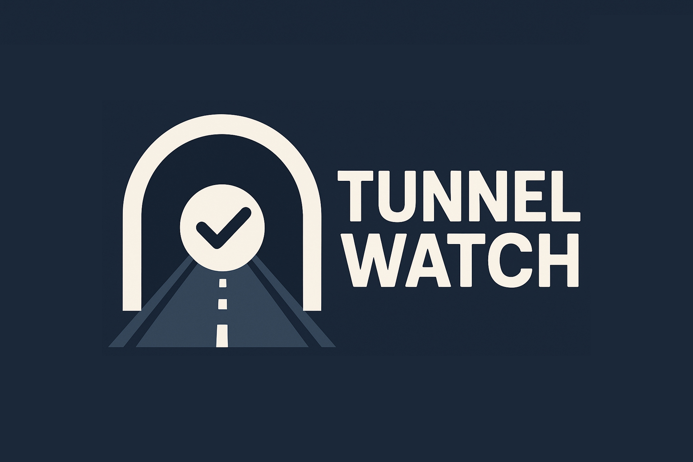

# 🚇 Tunnel Watch

**Tunnel Watch** is a lightweight port monitoring tool that watches local tunnel ports (e.g., VPNs, proxies, etc.) and automatically restarts a given systemd service if ports become unresponsive for a configurable number of consecutive failures.

---

## 🔧 Features

- 🔌 Monitors one or more local ports (e.g., `443`, `8443`, `2053`, etc.)
- ♻️ Restarts the target service if the ports are unreachable multiple times in a row
- ⏱ Configurable retry threshold and cooldown duration
- 💻 Runs as a persistent `systemd` service on Linux
- 🧩 Easy interactive setup via one-liner

---

## 🚀 Quick Start

Run this in your terminal (you need root access):

```bash
bash <(curl -s https://raw.githubusercontent.com/freecyberhawk/tunnel_watch/main/install.sh)
```
It will ask you:
	1.	Which ports to monitor (comma-separated like 443,8443)
	2.	The name of the systemd service to restart (e.g., hawk-proxy)
	3.	How many failures before restarting the service
	4.	How many seconds to wait after restarting before checking again

🛠 Dependencies
	•	bash
	•	nc (netcat)
	•	systemd-based Linux system

### Install `nc` if not already available:
```bash
sudo apt install netcat
```

## ☕️ Buy me a Coffee
Tether-USDT (BEP20): `0xe52d86cf875b11d8b95ab750e68fd418bba763b8`
